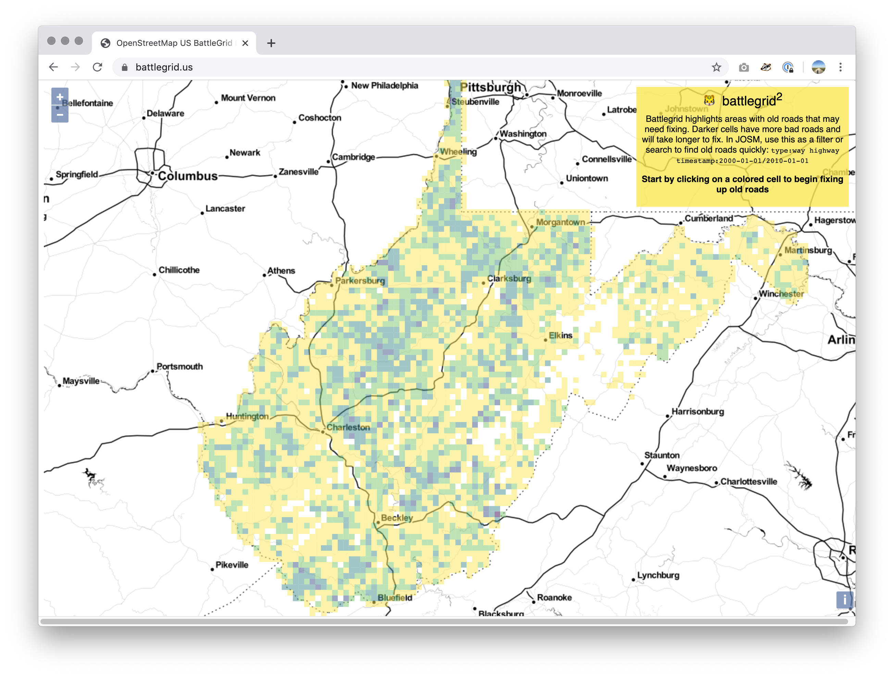

# Battlegrid 2

This is a new incarnation of the TIGER battlegrid. It is a map based web application that shows a grid cell overlay on top of a map that visualizes how severe the problem of 'unmaintained roads' in OSM is in that cell.

There's three parts to the application:

1. The cell data, stored in a PostGIS database and served up using Geoserver
2. The web application
3. A simple service endpoint written in Python/Flask that allows cell values to be updated from the web application

Each part needs to be set up manually.

* For the cell data, see TBD
* For the web application, see the [README](battlegrid2-web/README.md)
* For the service, see the [README](battlegrid2-flask/README.md)
