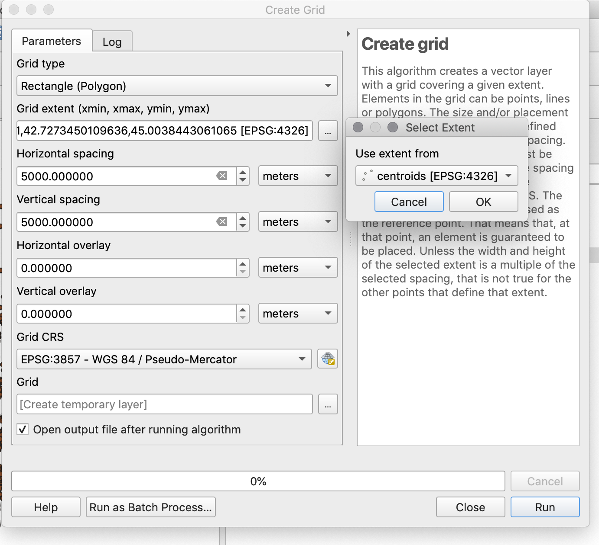

# Battlegrid 2 data

This guide takes you through preparing and serving the data for the Battlegrid web application.

For the server, we assume Ubuntu 18.04 LTS, but the data preparation steps are pretty OS-agnostic as long as you have PostgreSQL/PostGIS and QGIS installed.

## Data Prep

Needed:
* PostgreSQL 
* PostGIS
* osmosis (for loading OSM data)
* osmium command line tool

### Set up PostGIS

```
createuser -sP osm
createdb -U osm osm
psql -U osm -d osm -c 'create extension postgis'
psql -U osm -d osm -c 'create extension hstore'
psql -U osm -d osm -f /usr/local/Cellar/osmosis/0.47/libexec/script/pgsnapshot_schema_0.6.sql
psql -U osm -d osm -f /usr/local/Cellar/osmosis/0.47/libexec/script/pgsnapshot_schema_0.6_linestring.sql
```

### Get OSM data

This gets the filtered data directly from Overpass (see [the query](https://overpass-turbo.eu/s/OSN)) and loads it into PostGIS in one step. 

You will see the area ID `3600060759` in the example, this corresponds to the [OSM relation ID for Vermont](https://www.openstreetmap.org/relation/60759). (Overpass requires you add `3600000000` to the OSM relation ID so it can distinguish between node, way, and relation IDs.)

You can replace this with any relation ID for a reasonably sized area or replace with a different Overpass area definition.

```
curl "https://overpass-api.de/api/interpreter?data=area%283600060759%29-%3E.a%3B%0Away%5Bhighway%5D%28if%3A%20timestamp%28%29%20%3C%20%222010-01-01%22%29%28if%3A%20version%28%29%20%3C%203%29%28area.a%29%3B%0A%28._%3B%3E%3B%29%3B%0Aout%20meta%3B%0A" | osmosis --rx - --wp database=osm user=osm

```

### Centroids

We create a centroids helper table to enable quick processing in QGIS.

```
psql -d osm -U osm -c "create table centroids as (select st_centroid(linestring) geom, tstamp, id, st_length(linestring) length from ways)"
```

### QGIS processing

In QGIS, load the `centroids` PostGIS table.

Then use the Processing Toolbox to create a rectangle grid matching the centroids layer extent. Use EPSG:3857 so we get nice squarish cells on a mercator map. Use 5000x5000 meters for the cell sizes.




## Serving the Data

### Install Geoserver

* Install Tomcat 8 `apt install tomcat8`
* Install Geoserver
```
cd cd /var/lib/tomcat8/webapps/
wget http://sourceforge.net/projects/geoserver/files/GeoServer/2.16.1/geoserver-2.16.1-war.zip
unzip geoserver-2.16.1-war.zip
```
The application should now deploy itself and be available at `http://hostname:8080/geoserver`

